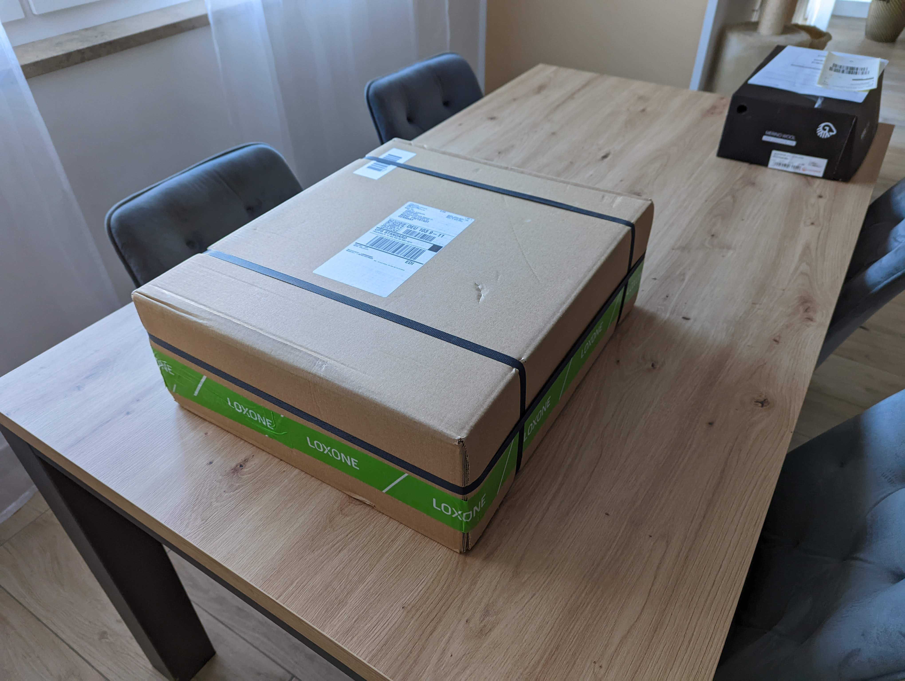
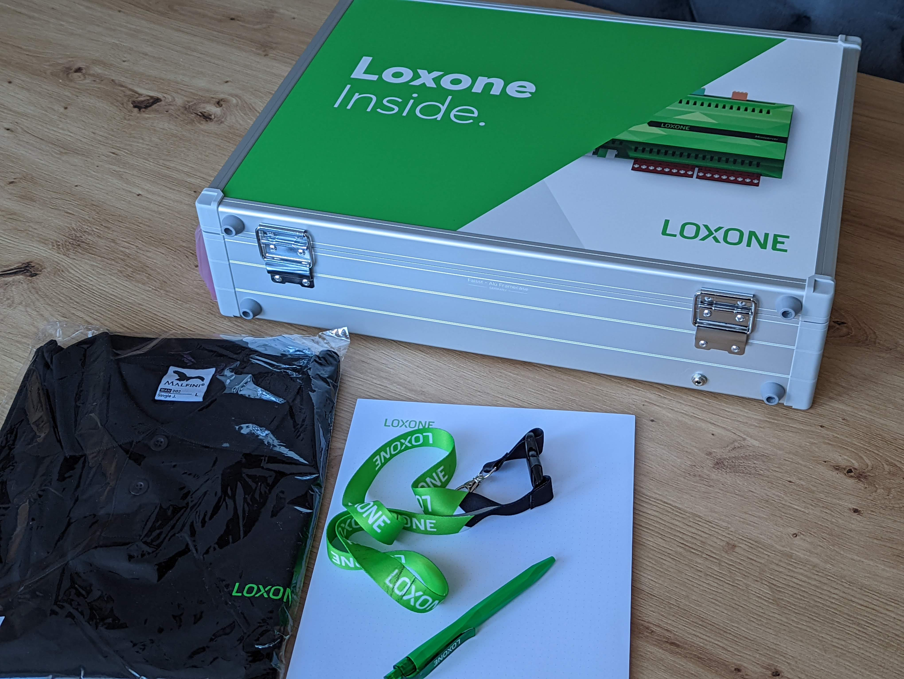
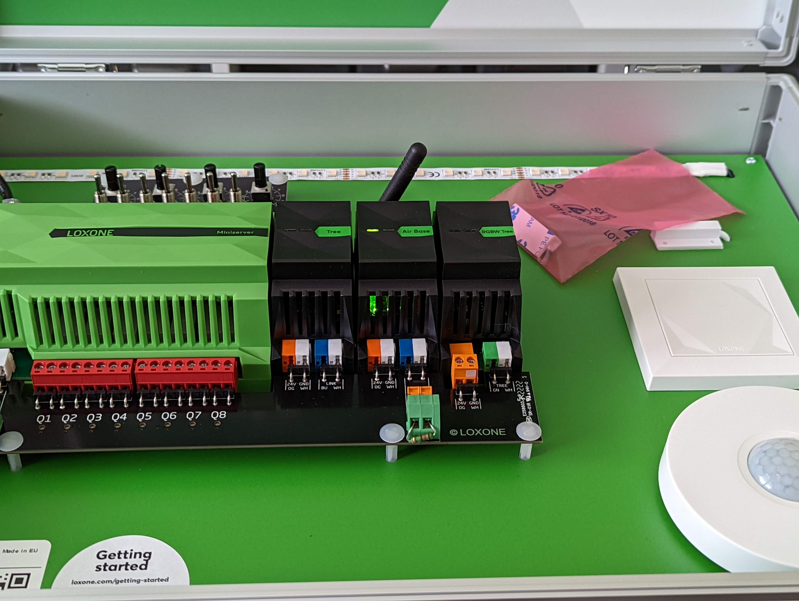

+++
author = "Hugo Authors"
title = "Loxone Musterkoffer"
date = "2022-08-15T20:13:33Z"
description = "Der erste Schritt zur Erreichung des Silver Partner Status"
tags = [
    "loxone"
]
categories = [
    "Loxone"
]
series = ["Loxone Serie"]
#aliases = ["migrate-from-jekyl"]
image = "PXL_20220810_073703857.jpg"
+++

> Der neue Loxone Musterkoffer bietet mit all seinen Komponenten an Bord die perfekte Umgebung für Test- und Demonstrationszwecke. Einfach an die Stromversorgung angeschlossen, können Sie mühelos und schnell Ihre Programme und Projekte testen.
> — <cite>Loxone Webseite</cite>

<!--more-->

## Warum?

Der Musterkoffer ermöglicht zwei Dinge. Zum einen erhält man ein Komplettset fertig zum Loslegen, um die Programmierung üben zu können. Zum anderen ist er ein Bestandteil der Loxone Partnerzertifizierung. Dadurch erhält man den Partnerstatus, um mit Loxone eine intensivere Geschäftsbeziehung eingehen zu können.

## Inhalt

* Miniserver
* Tree Extension
* Air Base Extension
* RGBW Dimmer Tree
* Präsenzmelder Tree
* Touch Tree
* RGBW LED Streifen
* Fensterkontakt
* Linksys Wireless 4 Port Router

  

## Nächste Schritte

Als nächstes steht das dreitägige Qualification Training an:
> Das Loxone Qualification Training bildet die Basis einer erfolgreichen Geschäfts­partnerschaft und ist Grundvoraussetzung zur Erreichung des Silver Partner Status. In der praxisnahen Ausbildung perfektionieren Sie Ihre Fähigkeiten in Sachen Planung, Konfiguration, Installation und Verkauf im Bereich der Gebäude­automatisierung.
> — <cite>Loxone Webseite</cite>
