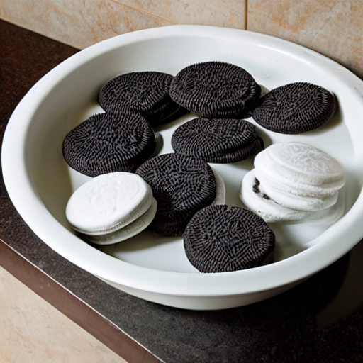
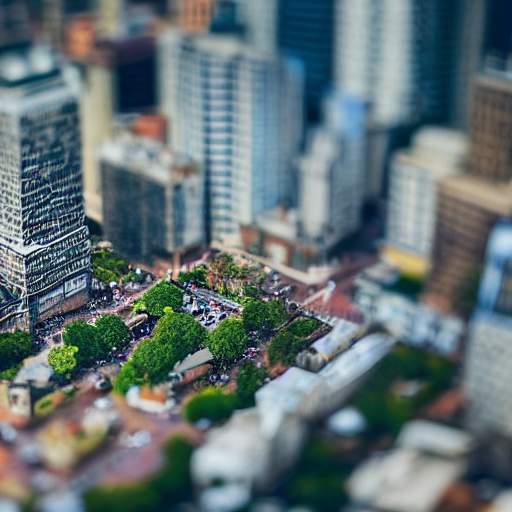
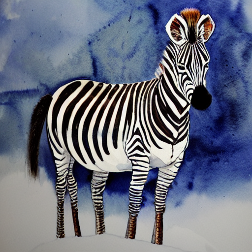
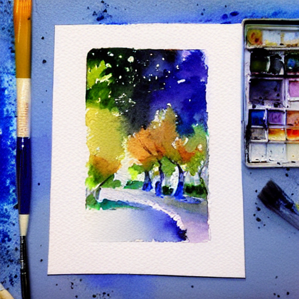

+++
author = "Philipp"
title = "Bilder generieren mit stability.ai"
date = "2022-08-22"
description = "Stable Diffusion wandelt Texteingaben in künstlerische Bilder um"
tags = [
    "AI"
]
categories = [
    "AI"
]
#series = ["Loxone Serie"]
#aliases = ["migrate-from-jekyl"]
image = "robot walking on water.png"
+++

## Twitter Thread




<!--more-->

## Vier Kreationen von mir
 
 

Wer selber mit dem Generieren loslegen möchte, kann das nach Anmeldung unter https://beta.dreamstudio.ai/dream tun.
