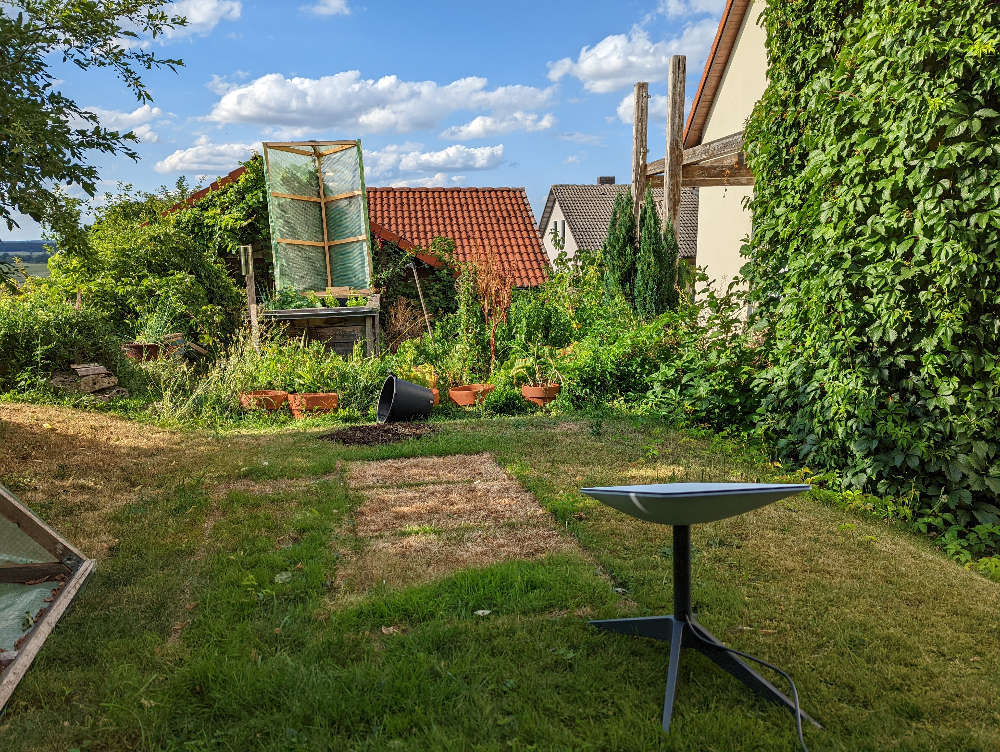
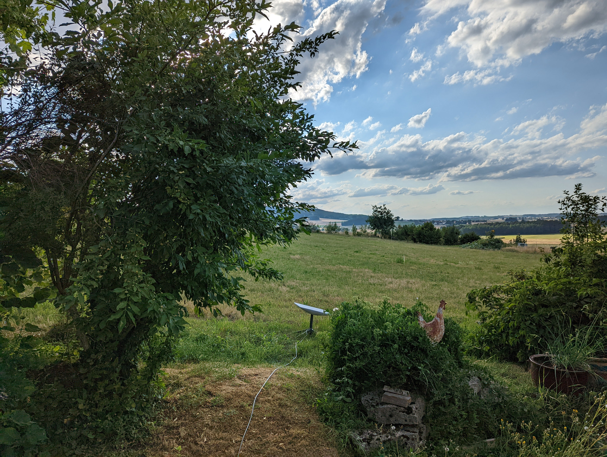
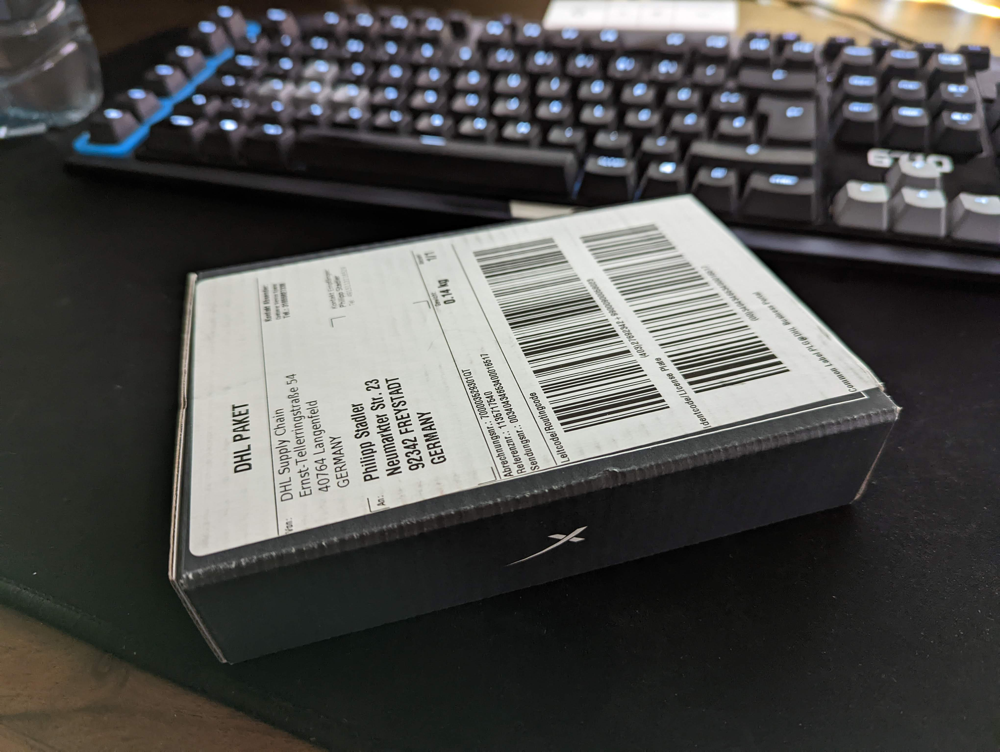

+++
author = "Philipp"
title = "Starlink Unboxing"
date = "2022-08-16"
description = "Leider noch nicht im Dauereinsatz"
tags = [
    "starlink"
]
categories = [
    "Starlink"
]
series = ["Starlink Serie"]
image = "Marketing_LandingFeatured_Next.jpg"
draft = false
+++

Zwecks anstehendem Umzug nächsten Jahres muss eine Alternative zur langsame DSL Leitung her. Ich habe mir daher ein Starlink Terminal bestellt und teste es im alltäglichen Einsatz.

<!--more-->

Der Aufbau gestaltet sich als einfach. Man nimmt alle Produkte aus der Packung, steckt den Router an 230 Volt und die Antenne an den Router.
